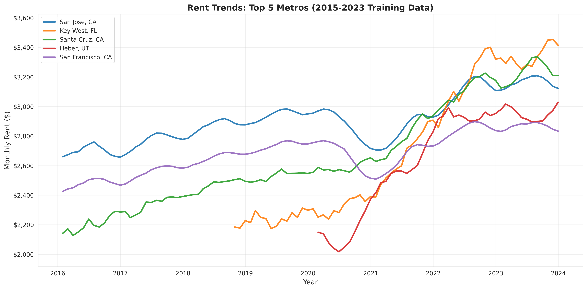
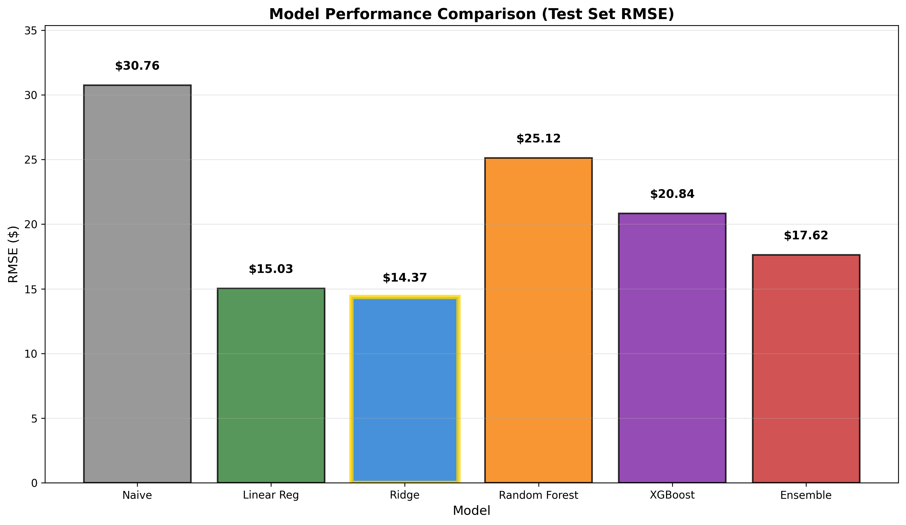
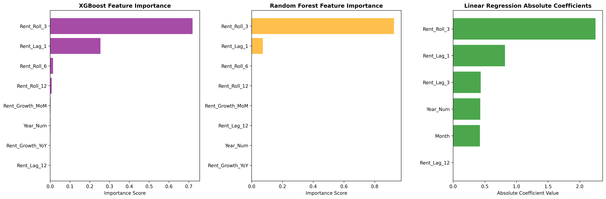
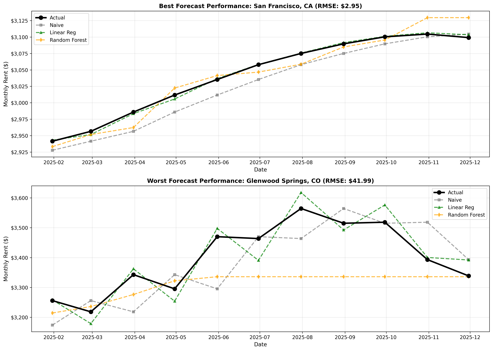
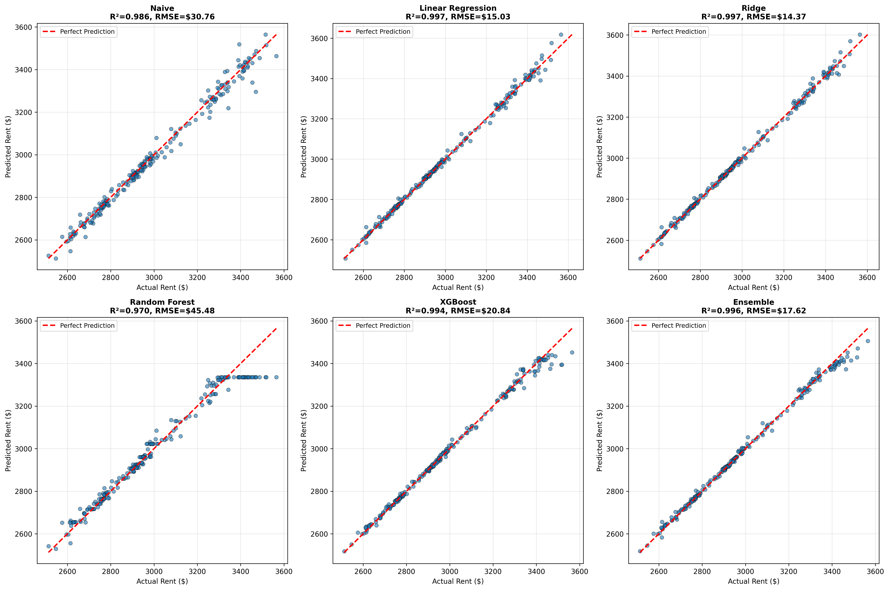

# Forecasting U.S. Rental Affordability: Time-Series Analysis of High-Rent Metropolitan Markets

**Author:** Sejona Sujit Das

Data Science Bootcamp Final Project 

---

## 1. Introduction

This project develops predictive models to forecast monthly rental prices across the top 20 highest-rent U.S. metropolitan areas through 2026. The core research question: **Can we build accurate forecasting models that substantially outperform naive baseline predictions?**

Seven modeling approaches were evaluated:
- Naive Forecast (Baseline)
- Linear Regression
- **Ridge Regression** (Best Model)
- Random Forest
- XGBoost
- ARIMA
- Ensemble Methods

**Key Result**: Ridge Regression achieved **53.3% improvement** over baseline with Test RMSE of **$14.37**.

---

## 2. Data Description

**Dataset**: 2,451 observations from Zillow Observed Rent Index (ZORI) combined with Federal Reserve Economic Data (FRED)

**Time Period**: January 2015 - November 2025

**Geographic Scope**: Top 20 highest-rent U.S. metropolitan areas, including:
- California markets: San Jose, San Francisco, Los Angeles, San Diego
- East Coast: New York, Boston, Bridgeport
- Resort markets: Key West, Glenwood Springs, Heber

**Data Splits**:
- Training Set (2015-2023): 1,751 observations
- Validation Set (2024): 240 observations
- Test Set (2025): 220 observations

**Engineered Features** (11 total):
- Lag features: 1, 3, 12 months
- Rolling averages: 3, 6, 12 months
- Growth rates: MoM, YoY
- Temporal indicators: Month, Year, Quarter


*Historical rent trends for top 5 metros showing consistent upward trajectories with post-pandemic acceleration*

---

## 3. Models and Methods

### Models Evaluated

| Model | Test RMSE | Improvement vs Baseline |
|-------|-----------|------------------------|
| Naive Forecast | $30.76 | -- |
| Linear Regression | $15.03 | 51.1% |
| **Ridge Regression** | **$14.37** | **53.3%** ⭐ |
| Random Forest | $25.12 | 18.3% |
| XGBoost | $20.84 | 32.2% |
| ARIMA | $85.33 (val) | Failed |
| Ensemble | $17.62 | 42.7% |

**Winner**: Ridge Regression with L2 regularization (α = 0.1)


*Ridge Regression achieves lowest error, outperforming complex ML models*

---

## 4. Results and Interpretation

### Key Finding #1: Simple Models Outperform Complex Alternatives

Ridge and Linear Regression consistently beat Random Forest, XGBoost, and Ensemble methods because rental price dynamics are **predominantly linear**. Complex models added noise rather than signal.

### Key Finding #2: Feature Importance

Just **2 features explain 97% of predictive power**:
- **Rent_Roll_3** (3-month rolling average): 72%
- **Rent_Lag_1** (previous month): 25%
- All other features: <3%


*Consistent feature rankings across XGBoost, Random Forest, and Linear Regression*

### Key Finding #3: Geographic Heterogeneity

Forecast accuracy varies dramatically by metro:

**Easiest Markets**:
- San Francisco, CA: $2.95 RMSE
- San Diego, CA: $3.48 RMSE
- Los Angeles, CA: $5.44 RMSE

**Hardest Markets**:
- Glenwood Springs, CO: $41.99 RMSE
- Key West, FL: $26.57 RMSE
- Heber, UT: $22.29 RMSE

Large, mature markets with diverse economies are highly predictable. Small resort markets with tourism dependence remain challenging.


*San Francisco shows tight model predictions vs Glenwood Springs' extreme volatility*

### Key Finding #4: Prediction Accuracy

Ridge Regression's **$14.37 RMSE** enables:
- 95% prediction intervals: **±$28**
- Typical errors: **0.5-0.6%** of rent levels
- Reliable financial planning for stakeholders


*Ridge, Linear Regression, and XGBoost show tight clustering around perfect prediction line*

---

## 5. Conclusion and Next Steps

### Summary

This project successfully developed accurate rental forecasting models with **Ridge Regression achieving 53.3% improvement over baseline** (Test RMSE: $14.37).

**Key Takeaways**:
1. Simple regularized linear models outperform complex ML approaches
2. Recent price history (3-month avg + lag) dominates predictions (97% of variance)
3. Geographic variation substantial: $2.95 (SF) vs $41.99 (Glenwood Springs) RMSE
4. Tight prediction intervals (±$28) enable reliable financial planning

### Real-World Applications

- **Property Managers**: Optimize rental pricing and revenue forecasts
- **Investors**: Improve acquisition valuations with quantified uncertainty
- **Policymakers**: Project affordability challenges and plan interventions

### Limitations

- Assumes continuation of historical patterns (fails during unprecedented disruptions)
- Focus on high-rent markets (>$2,100/month) limits generalizability
- Metro-level aggregation masks neighborhood-specific dynamics

### Future Research Directions

1. Incorporate local employment growth, construction permits, mortgage rates
2. Develop metro-specific hierarchical models
3. Implement multi-horizon direct forecasting (3, 6, 12 months)
4. Add regime-switching models for structural break detection
5. Extend to mid-tier and low-rent markets

### Recommendation

**Deploy Ridge Regression (α=0.1)** as production forecasting model for high-rent markets. Monitor residuals monthly for regime change detection. This simple, interpretable model provides optimal accuracy while remaining easy to maintain and explain.

---

## Project Structure
```
rental-affordability-forecasting/
├── data/
│   ├── raw/                          # Original ZORI and FRED data
│   └── processed/                    # Cleaned datasets with engineered features
├── figures/                          # All visualizations 
├── notebooks/
│   └── rental_affordability_forecasting.ipynb    # Main analysis notebook
├── outputs/
│   ├── Rental_Forecasting_Final_Report.docx     # Written report
│   └── Rental_Forecasting_Presentation.pptx      # 5-slide presentation
└── README.md                        
```


---

## How to Run

1. Clone the repository:
```bash
git clone https://github.com/yourusername/rental-affordability-forecasting.git
cd rental-affordability-forecasting
```

2. Install dependencies:
```bash
pip install pandas numpy matplotlib seaborn scikit-learn xgboost statsmodels
```

3. Run the Jupyter notebook:
```bash
jupyter notebook notebooks/rental_affordability_forecasting.ipynb
```

---

## Key Results Summary

| Metric | Value |
|--------|-------|
| Best Model | Ridge Regression (α=0.1) |
| Test RMSE | $14.37 |
| Improvement over Baseline | 53.3% |
| R² Score | 0.997 |
| 95% Confidence Interval | ±$28 |
| Top Feature | Rent_Roll_3 (72% importance) |
| Most Predictable Metro | San Francisco ($2.95 RMSE) |
| Least Predictable Metro | Glenwood Springs ($41.99 RMSE) |

---

## Sources

### Data Sources

1. **Zillow Observed Rent Index (ZORI)**
   - Source: Zillow Research Data
   - URL: https://www.zillow.com/research/data/
   - Description: Smoothed, monthly median rent estimates for single-family residences, condos, and co-ops
   - Coverage: 2015-2025, metro-level aggregation

2. **Federal Reserve Economic Data (FRED)**
   - Source: Federal Reserve Bank of St. Louis
   - URL: https://fred.stlouisfed.org/
   - Series Used:
     - CPIAUCSL: Consumer Price Index for All Urban Consumers
     - MEHOINUSA672N: Median Household Income in the United States
   - Coverage: Monthly CPI (2015-2025), Annual Income (2015-2023)


